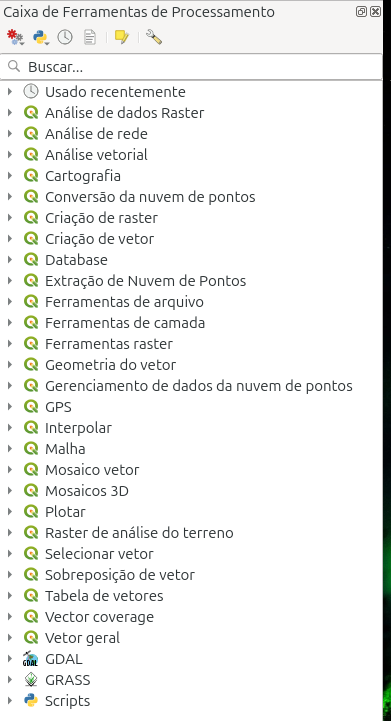
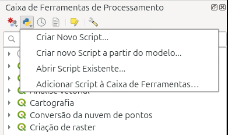
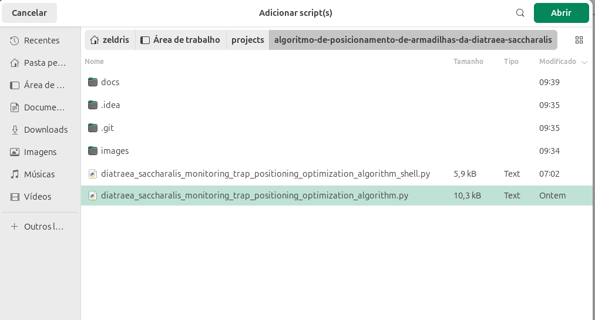
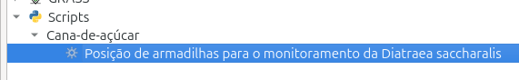
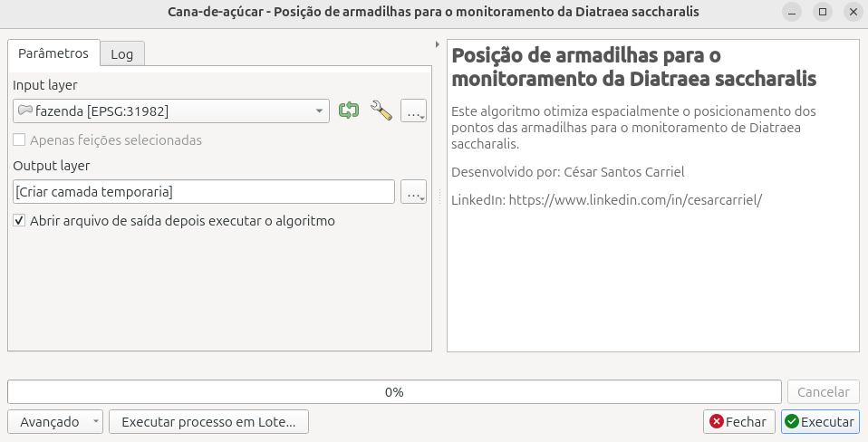
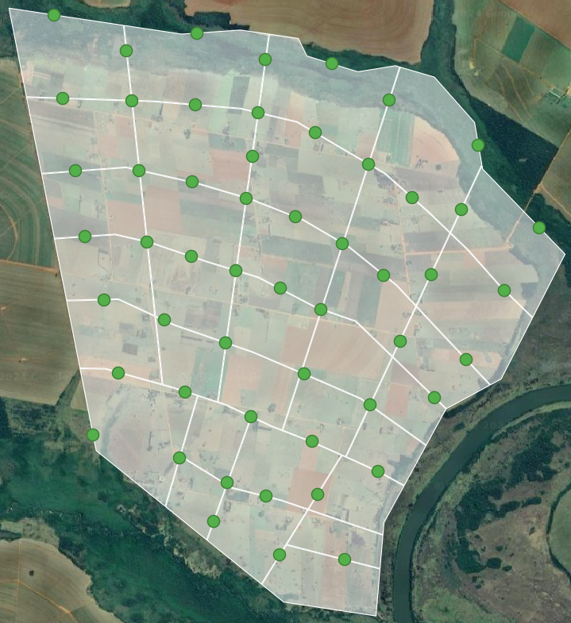

# Manual de Configuração e Uso

---

## Configurando o Projeto

Este projeto contém um algoritmo desenvolvido para ser executado como um script no **QGIS**, facilitando o posicionamento otimizado de armadilhas para o monitoramento da **Diatraea saccharalis**.

### Primeiros Passos:

1. Faça o download do projeto.
2. Abra o QGIS.

### Incluir o Script na Caixa de Ferramentas:

1. No QGIS, localize a **Caixa de Ferramentas** na parte lateral direita da interface.

  

2. Clique no ícone do **Python** localizado na parte superior da Caixa de Ferramentas. Um menu de opções será exibido.

  

3. Selecione a opção **Adicionar Script à Caixa de Ferramentas** e procure o arquivo `diatraea_saccharalis_monitoring_trap_positioning_optimization_algorithm.py` nos arquivos do projeto.

  

4. Acesse a seção **Scripts** da Caixa de Ferramentas (normalmente localizada na última opção). Dentro dela, você verá o grupo **cana-de-açúcar** e o script **Posição de Armadilhas para o Monitoramento da Diatraea saccharalis**.

  

5. Ao clicar no script, a interface de execução será exibida.

  

---

## Como Usar:

1. Com a interface do script aberta, selecione o polígono que representa a fazenda para a qual deseja calcular o posicionamento das armadilhas. Em seguida, clique em **Executar**.

  

2. Após a execução, os pontos das armadilhas otimizados serão exibidos, mostrando a maior área de cobertura para a fazenda.

  

---

Este manual guia você na configuração do script no QGIS e na utilização da ferramenta para otimizar o posicionamento das armadilhas na fazenda, garantindo maior eficiência na cobertura.
